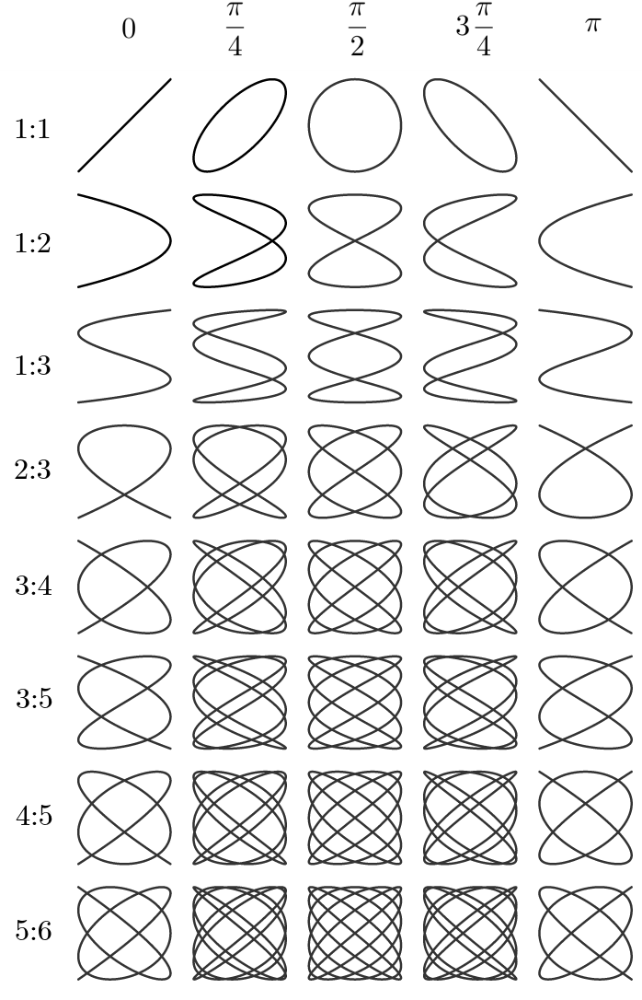

# HTTP Authentication
In this lab, you are going to create a [Flask](https://flask.palletsprojects.com/en/stable/) Web App with Protected [Lissajous](https://en.wikipedia.org/wiki/Lissajous_curve) GIF Customization, focusing on Lissajous GIF generation and protected parameter editing using both [Basic](https://en.wikipedia.org/wiki/Basic_access_authentication) and [Digest](https://en.wikipedia.org/wiki/Basic_access_authentication) HTTP authentication.

## Objectives:
1. Build a single-page web app to generate a Lissajous curve GIF.
2. Allow authenticated users to edit parameters:
   - Frequency and phase protected by `Basic HTTP Authentication`.
   - Curve color and background color protected by `Digest HTTP Authentication`.

In your report, 
- 🎏 explain the code you added or modified
- 💻 illustrate with screenshots of corresponding outputs


## Setup
Ensure you have the required libraries installed:
```bash
pip install Flask Flask-HTTPAuth Pillow
```

---

## Task 1: Initial Setup of the Flask Web App
**Flask** is a lightweight web framework in Python that makes it easy to create web applications and APIs. Known as a "micro-framework" because it has minimal built-in functionality, Flask provides the essential tools to handle HTTP requests, route URLs, render HTML templates, and manage sessions. It’s designed for flexibility, allowing developers to add only the components they need, such as databases, authentication, and form validation.

Key features of Flask:
- **Routing**: Maps URLs to Python functions, allowing developers to define routes and handle different endpoints.
- **Templating**: Integrates with Jinja2, a templating engine, to dynamically generate HTML.
- **Request handling**: Provides access to HTTP request data (such as form inputs, headers, and cookies).
- **Extensibility**: Supports numerous plugins and extensions (e.g., Flask-RESTful for APIs, Flask-SQLAlchemy for databases).

Flask is commonly used for small to medium-sized applications and quick prototyping, and it's highly favored for its simplicity, flexibility, and control over application structure.

### Subtasks
1. **Create a basic Flask app structure.**
2. **Set up routes** for the homepage and Lissajous GIF generation.
3. **Initialize HTTP Authentication** using [Flask-HTTPAuth](https://flask-httpauth.readthedocs.io/) for both Basic and Digest auth.

**Code for Initial Setup:**

```python
# Home page
@app.route('/', methods=['GET'])
def home():
    gif_data = 'Lissajous GIF data'.encode('ascii')
    return render_template_string(HOME_PAGE, gif_data=gif_data, **params)

# Route for updating Frequency and Phase (Basic Auth Required)
@app.route('/update_basic', methods=['GET','POST'])
def update_basic():
    if request.method == 'POST':
        return "<p>Update Frequency and Phase !</p>" 
    else:
        return "<p>Route for updating Frequency and Phase (Basic Auth Required)!</p>"  
 
# Route for updating Curve and Background Colors (Digest Auth Required)
@app.route('/update_digest', methods=['GET', 'POST'])
def update_digest():
    if request.method == 'POST':
        return "<p>Update Curve and Background Colors!</p>" 
    else:
        return "<p>Route for updating Curve and Background Colors (Digest Auth Required)!</p>"  
  

# Login route for Basic Auth to trigger the login pop-up
@app.route('/basic_login')
def basic_login():
  return "<p>Login route for Basic Auth to trigger the login pop-up!</p>"

# Login route for Digest Auth to trigger the login pop-up
@app.route('/digest_login')
def digest_login():
  return "<p>Login route for Digest Auth to trigger the login pop-up!</p>"
```

- 🎏 Describe the usage of each route
- 🎏 Run [t1.py](./code/t1.py), use `cURL and browser` to trigger each route
  - Run the web app: `python3 t1.py `
  - 💻 server-side and client-side outputs
  - 💻 find the details in requests and responses

---

## Task 2: Generate the Lissajous Curve GIF

A **Lissajous curve** is a complex, looping figure created by plotting two sine waves against each other on the x- and y-axes. The shape of the curve depends on the frequency and phase of each sine wave. By varying these parameters, Lissajous curves can form different patterns, from circles and ellipses to intricate figure-eight shapes and loops. These curves are often used in physics, electronics, and art to visualize harmonic motion and wave interference.

It is typically described by the following parametric equations:

- $x(t) = A \sin(a t + \delta)$
- $y(t) = B \sin(b t)$

where:
- $t$ is the parameter, typically representing time.
- $A$ and $B$ are amplitudes, determining the size of the curve along the x- and y-axes, respectively.
- $a$ and $b$ are the frequencies of oscillation in the x and y directions.
- $\delta$ is the phase difference between the two oscillations.

### Key Points:
- When $\dfrac{a}{b}$ is a rational number (e.g., $\frac{a}{b} = 1, 2, 3, \ldots$), the curve is **closed** and forms a repeating shape.
- When $\dfrac{a}{b}$ is irrational, the curve **does not close** and fills the space in a more intricate pattern.
- The **phase difference** $\delta$ affects the rotation and symmetry of the figure.



Create a function that generates a Lissajous curve GIF using the `PIL` library, based on the frequency, phase, curve color, and background color.

**Code for GIF Generation:**
```python
# Generate Lissajous curve
def generate_lissajous(freq, phase, curve_color, background_color):
    size = 100
    cycles = 5
    nframes = 64
    delay = 8
    frames = []
    for i in range(nframes):
        img = Image.new("RGB", (2 * size + 1, 2 * size + 1), background_color)
        draw = ImageDraw.Draw(img)
        for t in range(int(cycles * 2 * math.pi / 0.001)):
            x = math.sin(t * 0.001)
            y = math.sin(t * 0.001 * freq + phase)
            draw.point((size + int(x * size + 0.5), size + int(y * size + 0.5)), fill=curve_color)
        phase += 0.1
        frames.append(img)

    output = BytesIO()
    frames[0].save(output, format="GIF", save_all=True, append_images=frames[1:], loop=0, duration=delay * 10, disposal=2)
    return "data:image/gif;base64," + base64.b64encode(output.getvalue()).decode("ascii")
```

- Update handling homepage in `home()` embedding with Lissajous curve

```python
# Home page
@app.route('/', methods=['GET'])
def home():
    gif_data = generate_lissajous(params['freq'], params['phase'], params['curve_color'], params['background_color'])
    return render_template_string(HOME_PAGE, gif_data=gif_data, **params)
```

- Update the Route for updating Frequency and Phase

```python
# Route for modifying Frequency and Phase (Basic Auth Required)
@app.route('/update_basic', methods=['GET','POST'])
def update_basic():
    if request.method == 'POST':
        try:
            params['freq'] = float(request.form['freq'])
            params['phase'] = float(request.form['phase'])
            flash("Frequency and Phase updated successfully.")
        except ValueError:
            flash("Invalid values for Frequency or Phase.")
        return redirect(url_for('home'))
    else:
        return "<p>Route for updating Frequency and Phase (Basic Auth Required)!</p>"  
```

- Update the Route for modifying Curve and Background Colors

```python
# Route for updating Curve and Background Colors (Digest Auth Required)
@app.route('/update_digest', methods=['GET', 'POST'])
def update_digest():
    if request.method == 'POST':
        try:
            params['curve_color'] = tuple(map(int, request.form['curve_color'].replace('(', '').replace(')', '').split(',')))
            params['background_color'] = tuple(map(int, request.form['background_color'].replace('(', '').replace(')', '').split(',')))
            flash("Curve and Background colors updated successfully.")
        except ValueError:
            flash("Invalid color values.")
        return redirect(url_for('home'))
    else:
        return "<p>Route for updating Curve and Background Colors (Digest Auth Required)!</p>" 
```


- 🎏 Build your code `t2.py` incrementally from [t1.py](./code/t1.py)
- 🎏 Run `t2.py`, use `cURL and browser` to trigger each updated route
  - 💻 server-side and client-side outputs
  - 💻 find the details in requests and responses

---

## Task 3: Protect Frequency and phase Update with Basic Auth
**HTTP Basic Authentication** is a simple authentication mechanism used to secure web resources by requiring users to provide a username and password. Here's how it works:

1. **Request**: When a client (like a web browser) requests a protected resource from a server, the server responds with a `401 Unauthorized` status code, indicating that authentication is required.

2. **Authentication Prompt**: The client is prompted to send credentials (username and password). The credentials are sent in the **Authorization** header of the HTTP request in the following format:
   ```
   Authorization: Basic <base64_encoded_username:password>
   ```
   - The username and password are concatenated with a colon (`username:password`).
   - The concatenated string is then **base64-encoded** (this is not encryption, just encoding).
   
3. **Server Validation**: The server decodes the base64 string and checks if the credentials match the expected username and password (usually stored on the server). If they match, the server grants access to the requested resource.

4. **Response**: If authentication is successful, the server returns the requested resource. If the credentials are incorrect or missing, the server continues to respond with a `401 Unauthorized` status.

### Key Points:
- **Insecure**: Basic authentication sends credentials as base64-encoded text, which can be easily decoded. It is not encrypted unless used over HTTPS.
- **Stateless**: No session is maintained by the server between requests; each request must include the `Authorization` header.
- **Common Usage**: Basic authentication is often used for testing, simple API calls, or when implementing other authentication methods like digest authentication. It should always be used over HTTPS to protect the credentials.

**HTTP Basic Authentication**

- Basic Auth Verification

```python
# Basic Auth Verification
@basic_auth.verify_password
def verify_basic(username, password):
    if username in users and users[username] == password:
        return username
```

- Protect updating Frequency and Phase with Basic Auth

```python
# Route for updating Frequency and Phase (Basic Auth Required)
@app.route('/update_basic', methods=['GET','POST'])
@basic_auth.login_required
def update_basic():
    if request.method == 'POST':
        try:
            params['freq'] = float(request.form['freq'])
            params['phase'] = float(request.form['phase'])
            flash("Frequency and Phase updated successfully.")
        except ValueError:
            flash("Invalid values for Frequency or Phase.")
        return redirect(url_for('home'))
    else:
        return "<p>Route for updating Frequency and Phase (Basic Auth Required)!</p>" 
```

- Update the Login route for Basic Auth

```python
# Login route for Basic Auth to trigger the login pop-up
@app.route('/basic_login')
@basic_auth.login_required
def basic_login():
    flash("Basic Authenticated! You can now edit Frequency and Phase.")
    return '', 204  # No content response for JavaScript fetch
```

- 🎏 Build your code `t3.py` incrementally from `t2.py`
- 🎏 Run `t3.py`, use `cURL and browser` to trigger each updated route
  - 💻 server-side and client-side outputs
  - 💻 find the basic auth details in requests and responses

---

## Task 4: Protect Curve and Background Colors update with Digest Authentication
**HTTP Digest Authentication** is a more secure method than Basic Authentication for verifying a user's identity, as it involves hashing the credentials and the request data to prevent credentials from being sent in plaintext. Here's how it works:

### Process Overview:
1. **Request for Authentication**: When a client requests a protected resource, the server responds with a `401 Unauthorized` status and includes a **`WWW-Authenticate`** header specifying that **Digest Authentication** is required. The header also includes a **nonce** (a one-time value), the **realm** (an identifier for the protected area), and other parameters to be used in the hashing process.

   Example response:
   ```
   HTTP/1.1 401 Unauthorized
   WWW-Authenticate: Digest realm="Example", qop="auth", nonce="dcd98b7102dd2f0e8b04e9807d2f9d3c093", opaque="5ccc069c403ebaf9f0171e9517f40e41"
   ```

2. **Client Sends Credentials**: The client constructs a request with the `Authorization` header, including the **username**, **realm**, **nonce**, and a **hashed digest** of the credentials and the request details. The hash is created using a specific formula involving:
   - **HA1**: A hash of the username, realm, and password (usually using MD5).
   - **HA2**: A hash of the HTTP method (e.g., GET or POST) and the requested URL.
   - **Response hash**: This is created by combining HA1, HA2, the **nonce**, and additional details, and then hashing them together.

   The resulting `Authorization` header looks like this:
   ```
   Authorization: Digest username="admin", realm="Example", nonce="dcd98b7102dd2f0e8b04e9807d2f9d3c093", uri="/protected/resource", response="6629fae49393a05397450978507c4ef1", opaque="5ccc069c403ebaf9f0171e9517f40e41"
   ```

3. **Server Validation**: Upon receiving the request, the server performs the same hashing process using the stored password, the nonce, and the HTTP request data. If the computed hash matches the one in the `response` field of the client’s `Authorization` header, the credentials are considered valid, and the server grants access to the requested resource.

4. **Advantages over Basic Authentication**:
   - **No Plaintext Passwords**: The password is never sent directly over the network. Instead, a hashed value is transmitted, making it less vulnerable to interception.
   - **Protection Against Replay Attacks**: The use of a nonce ensures that each request is unique, preventing attackers from reusing credentials to impersonate a user.
   - **More Secure**: Digest Authentication is more secure than Basic Authentication because it does not expose the password directly and incorporates several security mechanisms like salting and hashing.

### Key Points:
- **Hashing**: Instead of sending the password directly, Digest Authentication uses a hash of the password, request data, and a nonce.
- **Secure**: It prevents the transmission of plaintext passwords, reducing the risk of interception.
- **Nonce**: The server provides a nonce for each request to ensure that the authentication process is fresh and not replayed by attackers.
- **Complexity**: Digest Authentication is more complex to implement and requires both the server and client to handle hashing and nonces.

Like Basic Authentication, Digest Authentication also works best when used over **HTTPS** to further protect against interception.


**HTTP Digest Authentication:**

```python
# Digest Auth Verification
@digest_auth.get_password
def get_digest_password(username):
    if username in users:
        return users[username]
    return None
```

- Protect updating Curve and Background Colors with Digest Auth

```python
# Route for updating Curve and Background Colors (Digest Auth Required)
@app.route('/update_digest', methods=['GET', 'POST'])
@digest_auth.login_required
def update_digest():
    if request.method == 'POST':
        try:
            params['curve_color'] = tuple(map(int, request.form['curve_color'].replace('(', '').replace(')', '').split(',')))
            params['background_color'] = tuple(map(int, request.form['background_color'].replace('(', '').replace(')', '').split(',')))
            flash("Curve and Background colors updated successfully.")
        except ValueError:
            flash("Invalid color values.")
        return redirect(url_for('home'))
    else:
        return "<p>Route for updating Curve and Background Colors (Digest Auth Required)!</p>"
```

- Update the Login route for Digest Auth

```python
# Login route for Digest Auth to trigger the login pop-up
@app.route('/digest_login')
@digest_auth.login_required
def digest_login():
    flash("Digest Authenticated! You can now edit Curve and Background Colors.")
    return '', 204  # No content response for JavaScript fetch
```

- 🎏 Build your code `t4.py` incrementally from `t3.py`
- 🎏 Run `t4.py`, use `cURL and browser` to trigger each updated route
  - 💻 server-side and client-side outputs
  - 💻 find the digest auth details in requests and responses

## Summary:
In this lab, you’ve set up a Flask app that:
- Generates a Lissajous GIF based on editable parameters.
- Protects specific parameter updates with Basic and Digest HTTP Authentication.

# References
- [HTTP authentication](https://developer.mozilla.org/en-US/docs/Web/HTTP/Authentication)
- [HTTP Basic access authentication](https://en.wikipedia.org/wiki/Basic_access_authentication)
- [HTTP Digest access authentication](https://en.wikipedia.org/wiki/Digest_access_authentication)
  - [RFC 7616](https://datatracker.ietf.org/doc/html/rfc7616#section-3.9.1)
- [Requests Authentication](https://requests.readthedocs.io/en/latest/user/authentication/)
- [Lissajous curve](https://en.wikipedia.org/wiki/Lissajous_curve)
