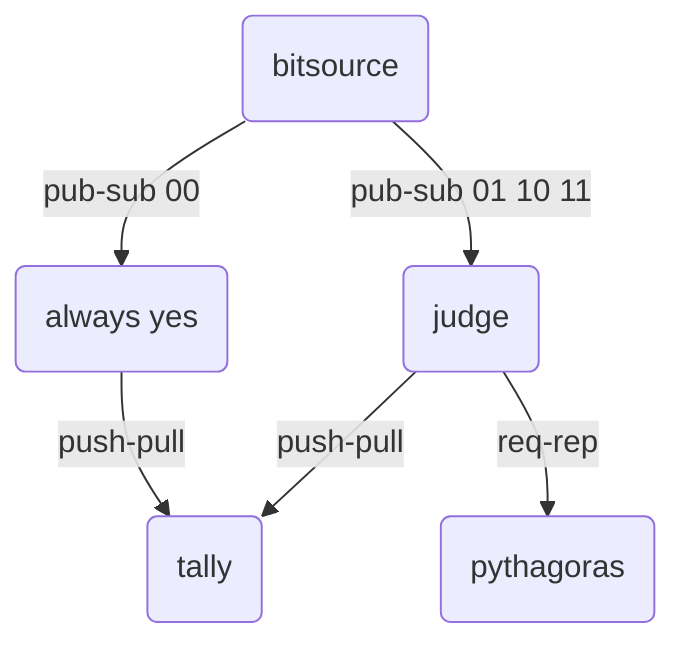

# Caches and Message Queues


Caches and Message Queues
---
- two popular and powerful building blocks for heavy-load services
- provide caches, queues, and load distribution for services
- general tools agnostic about carried data


[memcached](https://memcached.org/)
---
- a distributed memory object caching system
- combines free idle RAM on servers into a large least-recently used (LRU) cache
- like a short-term memory for applications
  - data stored in Memcached can be thrown away at the server’s discretion
    - you can set an expiration date and time on each item
  - don't store data that cannot be reconstructed from other sources of information
- designed to speed up operations by remembering results that are expensive to recompute
- size limit of each item
  - key size ≤ 256 bytes; value size ≤ 1M bytes


Using memcached
---
- run a Memcached daemon on every server with some spare memory
  - the daemon creates  an organization-wide fast [key-value cache](https://lzone.de/cheat-sheet/memcached)
- make a list of (IP address, port number) of your new Memcached daemons
  - distribute this list to all of the clients (custom programs) that will be using the cache
- now the clients have access to the big cache


🖊️ Practice
---
- install memcached
  ```bash
  # install
  sudo apt install memcached
  # check status
  sudo systemctl status memcached
  ```
- install memcached Python client
  - [pymemcache](https://pymemcache.readthedocs.io)
    ```bash
    # install 
    pip install pymemcache
    ```
- use pymemcache
  ```python
  from pymemcache.client.base import Client

  client = Client('localhost')
  # write a string as a value to memcached, the string is encoded as UTF-8
  client.set('some_key', 'some_value')
  # read the string from memcached, it is encoded from UTF-8
  result = client.get('some_key')
  # Any other kind of Python object will trigger memcache to auto-pickle the value
  ```
- further [explore](https://pymemcache.readthedocs.io/en/latest/getting_started.html)

💡 Application: Using Memcached to Accelerate an Expensive Operation
---
- [expensive square](./cmq/squares.py)


Hashing and Sharding
---
- an effective way to distribute items across several memcached servers evenly
- sharding an item means 
  - hash its key’s string value 
  - let the hash determine which server is used to store that particular item


🖊️ Practice
---
- Run [hashing.py](./cmq/hashing.py) then explain its output


Message queues
---
- promise to transmit messages reliably and to deliver them atomically
  - a message either arrives whole and intact 
  - or it does not arrive at all
- support builtin framing
- support all kinds of topologies between messaging clients
  -  asynchronous communication
  -  custom remote procedure call (RPC) 
  -  high-volume event data aggregation
- support severl topologies
  - pipeline
    - every queued message is delivered to exactly one consumer
  - publisher-subscriber or fanout
    - subscribers receive all the messages passed its filter that are being queued the publishers
  - request-reply
    -  messages have to make a round-trip
    -  a message queue client that makes a request has to stay connected and wait for the reply to be delivered to it
- implementation
  - with a centralized message broker [AMQP: Advanced Message Queuing Protocol](https://www.amqp.org/)
    - language-agnostic
    - supported by open source message brokers like [RabbitMQ](https://www.rabbitmq.com/), [Qpid](https://qpid.apache.org/), and [Redis](https://redis.io/)
    - packaged by many third-party libraries like [Celery - Distributed Task Queue](https://docs.celeryq.dev/)
  - as a library [ZeroMQ (also known as ØMQ, 0MQ, or zmq)](https://zeromq.org/)
    - bound to Python as [pyzmq](https://pyzmq.readthedocs.io/)


💡 Demo: The topology of the [simple Monte Carlo estimate of π](https://en.wikipedia.org/wiki/Monte_Carlo_method)
---

- [queuepi.py](./cmq/queuepi.py)


# References
- [AttributeError: module 'memcache' has no attribute 'Client'](https://stackoverflow.com/questions/72213260/attributeerror-module-memcache-has-no-attribute-client)