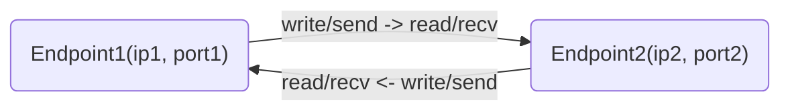

# Socket programming

Access network information
---
- [source code](./code/socketpro.ipynb)
  ```bash
  sudo apt install  ipython3 jupyter jupyter-notebook
  ```

Get & set socket options
---
- make port number reusable
  - [source code](./code/reuseaddr.py)


Endpoint: (IP : Port number)
---
- Source (8.8.8.8:53) -> Destination (10.0.2.5:46132)
- 3 types of UDP and TCP port numbers
  - well-known ports (0-1023)
  - registered ports (1024-49151)
  - free ports (49152-65535)

```python
# find well-known port number
import socket
socket.getservbyname('http') # ->80

# socket.getaddrinfo() can get port as well
```


[UDP](https://en.wikipedia.org/wiki/User_Datagram_Protocol)
---
- User Datagram Protocol
  - connectionless, unreliable
  - no guarantee of delivery, ordering, or duplicate protection
  - no congestion control, lightweight
- Suitable applications
  - time-sensitive
  - error tolerable
  - broadcast and multicast


🖊️ Practice
---
- Play with [udp_local.py](./udp/udp_local.py)
  ```bash
  # in two terminals, one runs udp server, 
  ./udp_local.py server

  # the other runs udp client
  ./udp_local.py client
  ./udp_local.py client
  ```
- Spoof the server
  ```bash
  # in the server terminal, ctrl+z suspend the server
  # in the client terminal, run the client
  ./udp_local.py client # note the port number Pclient

  # in the server terminal
  nc -u localhost Pclient # type something and enter
  # the client prints those typing and quit
  ```
- promiscuous client accepts every packet it received
  - identify requests and responses with unique id numbers


🖊️ Practice
---
- Unreliability, Backoff, Blocking, and Timeouts
- play with [udp_remote.py](./udp/udp_remote.py)
  ```bash
  # on seed vm, in the folder contains udp_remote.py
  python3 -m http.server

  # on parrot, access seed http.server by a browser
  # download udp_remote.py and run it
  python3 udp_remote.py server ""

  # on seed, 
  python3 udp_remote.py client parrotIP
  ```


🖊️ Practice
---
- UDP fragmentation  
  - play with [big_sender.py](./udp/big_sender.py) to find the MTU
    ```bash
    ./big_sender.py parrotIP

    ./big_sender.py 127.0.0.1
    ```
- broadcast vs. multicast
  - play with [udp_broadcast.py](./udp/udp_broadcast.py)
    ```bash
    # run multiple server
    ./udp_broadcast.py server ""

    # send message to broadcast address
    ./udp_broadcast.py client 10.0.2.255
    ```
  

[TCP](https://en.wikipedia.org/wiki/Transmission_Control_Protocol)
---
- Transmission Control Protocol 
- reliable, ordered, and error-checked delivery of packets
- supports the majority of application protocols
  - HTTP, FTP, SMTP, POP3, SSH, etc.


How TCP works?
---
- every TCP packet is identified by a sequence number
  - the initial sequence number is randomly chosen
- next sequence number = current sequence number + current packet size in bytes
- TCP window - bursts of packets at a time expecting a single response
- builtin flow control
- automatic retransmission of unacknowledged packets


Establish and terminate TCP connection
---
- packet (sequence number, acknowledge number)
- three-way (or 3-step) handshake to establish
  - SYN (A, -), SYN-ACK (B, A+1), ACK (A+1, B+1)
- four-way handshake to terminate
  - FIN, ACK, FIN, ACK
- a TCP connection (client: active or connected socket, server: passive or listening socket)
  - e.g. (local ip : local port, remote ip : remote port)


💡 Demo
---
- Show the TCP connection 
  - establishment in three-way handshake
  - termination in four-way handshake


🖊️ Practice
---
- play with the simple [tcp server/client program](./tcp/tcp_sixteen.py)

```bash
# 1. run the client only and analyze the exception
python3 tcp_sixteen.py client localhost
# before send() and recv(), a TCP connection must be established first
# compare this with UDP

# 2. open two terminals, one runs server, the other runs client
python3 tcp_sixteen.py server ""

python3 tcp_sixteen.py client localhost
python3 tcp_sixteen.py client 127.0.0.1

# 3. comment out line 21 in  tcp_sixteen.py 
# run the server in another terminal
# analyze what happened
python3 tcp_sixteen.py server ""

# 4. bind to a specified interface
python tcp_sixteen.py server ip
```


Deadlock
---
- can occur in TCP applications without good design
  - TCP stack sending and receiving buffers are limited
  - send and receive lock mutually
- ways to solve deadlock
  - use non-blocking mode
  - use multiple threads
  - use select() or poll() to handle multiple inputs


🖊️ Practice
---
- try possible inputs that can put [tcp_deadlock.py](./tcp/tcp_deadlock.py) into deadlock

```bash
# open two terminals, one runs the server
python3 tcp_deadlock.py server ""

# in the other terminal, run the client
python tcp_deadlock.py client 127.0.0.1 32

# then try this, will it cause deadlock?
# will this happen to UDP?
 python tcp_deadlock.py client 127.0.0.1 16000000

```


How to close a TCP connection?
---
- a TCP stream is duplex (bidirectional)

- a socket recv() returns an empty string when 
  - the socket is closed in blocking mode
  - raises an exception in nonblocking mode, indicates that no data is available at the moment
- no waiting on close if any received message can be determined
  - e.g. fixed size message
- call shutdown(direction) to close the unused direction or both
  - direction = socket.SHUT_WR: shut down the outgoing direction
    - the other end receives EOF
  - direction = socket.SHUT_RD: shut down the incoming direction
    - an EOF error occurs if the other side tries to write
  - direction = socket.SHUT_RDWR: disable the socket from everyone using it if it is shared
    - close() only ends the caller process's relationship with this shared socket
  - unidirectional is useful in some applications


Using TCP stream like files
---
- A TCP stream is a sequential data
  - read and write sequential data are fundamental OS operations
  - File object supports read() and write()
  - Socket object supports send() and recv()
- a socket can be read and written as a normal file descriptor

```python
# socket.makefile() returns a Python file object
# which calls recv() for reading and send() for writing
import socket
sock = socket.socket(socket.AF_INET, socket.SOCK_STREAM)
hasattr(sock, 'read') # => False

f = sock.makefile()
hasattr(sock, 'read') # => True

fn = sock.fileno()
print(fn)

# investigate with lsof -a -i4 -itcp
```

## 🏃 Simple socket programs

Get time from the internet time server
---
- [Network Time Protocol (NTP)](https://en.wikipedia.org/wiki/Network_Time_Protocol) can be used to synchronize your machine time with one of the internet time servers.
  - [Network Time Protocol Version 4: Protocol and Algorithms Specification RFC 5905](https://datatracker.ietf.org/doc/rfc5905/)
- Simple Network Time Protocol (SNTP) can be used to get the time from NTP server but not as accurate as NTP
  ```bash
  # install ntplib
  sudo apt install python3-pip
  pip3 install ntplib
  ```
- 🍎 Get ntp time
  ```python
  import ntplib
  from time import ctime

  def get_ntp_time(server='pool.ntp.org'):
      try:
          # Create an NTP client
          ntp_client = ntplib.NTPClient()
          
          # Query the NTP server
          response = ntp_client.request(server, version=3)
          
          # Convert the timestamp to a readable format
          current_time = ctime(response.tx_time)
          
          print(f"Current time from NTP server {server}: {current_time}")
          
      except ntplib.NTPException as e:
          print(f"Failed to get time from NTP server. Error: {e}")
      except Exception as e:
          print(f"An unexpected error occurred: {e}")

  if __name__ == "__main__":
      get_ntp_time()
  ```

- 🍎 Time epochs
  - **Unix Time**: The `time.time()` function returns the current time in seconds since the `Unix epoch (January 1, 1970, 00:00:00 UTC)`. 
    - This is a floating-point number (excluding leap seconds) 
  - **NTP Timestamp**: To convert Unix time to an NTP timestamp, 
    - we add the difference between the `NTP epoch (January 1, 1900)` and the `Unix epoch (January 1, 1970)`, 
    - which is 2208988800 seconds.


  ```python
  import time
  import ntplib
  from datetime import datetime, timezone

  # 1. Get the current Unix time (seconds since the Unix epoch, January 1, 1970)
  unix_time = time.time()
  print(f"Current Unix time: {unix_time}")

  # 2. Convert Unix time to an NTP timestamp
  # NTP timestamp is the number of seconds since January 1, 1900
  NTP_EPOCH = 2208988800  # Difference between Unix epoch (1970) and NTP epoch (1900)
  ntp_timestamp = unix_time + NTP_EPOCH
  print(f"Corresponding NTP timestamp: {ntp_timestamp}")

  # 3. Convert an NTP timestamp to a human-readable local time
  # (Assuming we get the NTP time from an NTP server)
  client = ntplib.NTPClient()
  response = client.request('pool.ntp.org')
  ntp_time = response.tx_time  # NTP time from the server (in Unix format)

  # Convert the Unix time from NTP server to local time
  local_time = datetime.fromtimestamp(ntp_time, tz=timezone.utc).astimezone()
  print(f"NTP time in human-readable local time: {local_time}")

  # 4. Convert Unix time to human-readable local time
  human_readable_time = datetime.fromtimestamp(unix_time)
  print(f"Current Unix time in human-readable local time: {human_readable_time}")
  ```

## 🛠️ [Scapy](https://scapy.readthedocs.io/)

**What is Scapy?**

* Powerful Python program for network packet manipulation.
* Sends, sniffs, dissects, and forges packets.
* Useful for network tasks like scanning, probing, and attacks (ethical use!).
* Replaces tools like hping, Nmap (partially), tcpdump, and more.

**Why Choose Scapy?**

* **Flexibility:** Build custom packets beyond tool limitations.
* **Complete Information:** Receive full decoded packets, not interpretations.
* **Fast Development:** Describe packets with concise Python syntax.
* **Multiple Interpretations:** Analyze data from various perspectives.
* **Decodes, not Interprets:** Avoids biased results; focus on facts.

**Fast Packet Design**

* Scapy uses a Domain Specific Language (DSL) based on Python.
* Describe packets as layers stacked on top of each other.
* Override default values as needed for specific tasks.
* Create complex packets in just a few lines of code.

**💡[Demo - Basic Usage](https://scapy.readthedocs.io/en/latest/introduction.html#quick-demo)**

* Create multiple IP packets with a single line.
* Manipulate existing packets (change destination, TTL).
* Build complex packets with multiple layers (Ethernet, IP, UDP).
* Scapy uses sensible default values for common fields.

## 💡 ntp in Scapy
```bash
# install scapy
pip install scapy

# run scapy without sudo
sudo setcap cap_net_raw+eip $(which python3)
sudo setcap cap_net_raw+eip $(which python)
sudo setcap cap_net_raw+eip $(which scapy)
```
- [socket + scapy](./tcp/scntp2.py)
- [scapy only](./tcp/scntp.py)

# References
- [socket — Low-level networking interface](https://docs.python.org/3/library/socket.html)
- [argparse — Parser for command-line options, arguments and sub-commands](https://docs.python.org/3/library/argparse.html)
- [ntplib](https://pypi.org/project/ntplib/)