#  Building and Parsing E-Mail 
FPNP3e ch12


A big picture
---
- [Electronic mail (email or e-mail)](https://en.wikipedia.org/wiki/Email) is a method of transmitting and receiving messages using electronic devices

```mermaid
flowchart RL
  subgraph source
    direction TB
    S(email sender<br>【Alice】) 
    MUA[mail client「ThunderBird」<br>mail user agent 『MUA』]
    MSA[collection mail server「Postfix」<br>mail submission agent『MSA』] 
    MDA1[distribution mail server「Dovecot」<br>mail delivery agent『MDA』]
    S-->|①write|MUA
    MUA-.➏read.->S
    MUA-->|②SMTP<br>port:『25, 587』|MSA
    MDA1-.➎Internet Message Access Protocol『IMAP』<br> Post Office Protocol『POP3』.->MUA       
  end

  subgraph internet
  MTA[transfer mail server「Postfix」<br>mail transfer agent『MTA』]  
  end

  subgraph destination
    direction TB
    MDA[distribution mail server「Dovecot」<br>mail delivery agent『MDA』]
    MUA2[mail client「ThunderBird」<br>mail user agent 『MUA』]
    MSA2[collection mail server「Postfix」<br>mail submission agent『MSA』]
    R(email receiver<br>【Bob】)
    MDA-->|⑤Internet Message Access Protocol『IMAP』<br> Post Office Protocol『POP3』|MUA2
    MUA2-->|⑥read|R
    R-. ➊write.->MUA2
    MUA2-.➋SMTP<br>port:『25, 587』.->MSA2
  end

  destination-.|➌SMTP|.->internet
  source-->|③SMTP|internet
  internet-->|④SMTP|destination
  internet-.|➍SMTP|.->source  
```



The lifespan of an email
---
- A sender $S$ submit an email $e$ by the *Simple Mail Transport Protocol (SMTP:25)* to an email server $S_s$
  - SMTP Secure (SMTPS) uses port number 587
    - Port 465 is also used sometimes but outdated
- $e$ is delivered from $S_s$ through a serials of intermediary email servers $S_{m_i}$ to the receiver $R$'s email server $S_r$
- $R$ accesses $e$ from $S_r$ through the *Post Office Protocol v3 (POP3:110)* or the *Internet Message Access Protocol (IMAP:143)* using email clients such as
  - Mozilla Thunderbird, Microsoft Outlook
  - webmail services are prevalent today which let users
    - log on the email server with a web browser 
    - view their emails rendered as HTML 
    - the e-mails remain on the email server
  - the secured versions of POP3 and IMAP are *POP3S:995* and *IMAPS:993* respectively


💡 Explore
---
- [The lifespan of an email](https://en.wikipedia.org/wiki/Email)


🔭 Explore Email servers
---
- [DOVECOT: The Secure IMAP server](https://www.dovecot.org/)
  - [Install and configure Dovecot](https://ubuntu.com/server/docs/mail-dovecot)
  - [Postfix: a mail transfer agent (MTA) ](https://www.postfix.org/)
  - [Exim Internet Mailer](https://www.exim.org/)
- [Mailu: a simple yet full-featured mail server](https://mailu.io/)
- [DMS: docker-mailserver](https://docker-mailserver.github.io/docker-mailserver/latest/)
- [James: Java Apache Mail Enterprise Server](https://james.apache.org/)


🖊️ Practice
---
- Install local email systems *option 1*
  - [Dovecot](https://help.ubuntu.com/community/Dovecot)
  - [Postfix](https://ubuntu.com/server/docs/mail-postfix)
    - [How to use Sendmail](https://help.dreamhost.com/hc/en-us/articles/216687518-How-to-use-Sendmail)

```bash
# 0. default certificate 
sudo apt-get install ssl-cert
sudo make-ssl-cert generate-default-snakeoil
sudo usermod --append --groups ssl-cert $USER

# 1. install dovecot
sudo apt install dovecot-imapd dovecot-pop3d
# test installation
sudo systemctl status dovecot
ss -l lpt # lnpt
telnet localhost smtp
telnet localhost pop3
telnet localhost imap2
openssl s_client -connect localhost:993 # imaps
openssl s_client -connect localhost:995 # pop3s
openssl s_client -connect localhost:587 # smtps

# 2. install Postfix
sudo apt install postfix # choose local only

# 3. sendmail
# create a new user
sudo adduser emailuser1
sudo adduser trump
sudo adduser biden

# send an email to the new user
sendmail emailuser1@localhost
Subject: Test email
Hello? How are you?
CTRL+D
```
- Install local email systems *option 2*
  - [Setting up James as an IMAP server](https://james.apache.org/howTo/imap-server.html)


E-Mail
---
- represented as plain ASCII text 
  - using character codes 1 through 127
  - other standards are supplemented to support Unicode characters and binary payloads
- the end-of-line marker is CRLF (carriage-return linefeed, \r\n, ASCII: 13,10 )
- consists of 
  - headers
    - each header consists of a case-insensitive name, a colon, and a value
      - can stretch to several lines indented with whitespace except the first line 
  - a blank line 
  - the body
- E-Mail Message Format is defined in standard [RFC 5322](https://datatracker.ietf.org/doc/html/rfc5322)


💡 Demo
---
- Go through the components of an email
  - especially the list of headers
- many of the headers were added by clients and servers along the email transmission
  - each client and server in route reserves the right to add additional headers


🔭 Explore
---
- Popular [email headers](https://en.wikipedia.org/wiki/Email#Message_header)


💡 Demo 
---
- [An Example: Building an E-Mail Message](./email/build_basic_email.py)
- using the [email](https://docs.python.org/3/library/email.html) package
  - [examples](https://docs.python.org/3/library/email.examples.html)


Adding HTML and Multimedia
---
- [Multipurpose Internet Mail Extensions (MIME)](https://en.wikipedia.org/wiki/MIME) extends the format of email messages to support 
  - text in character sets other than ASCII
  - attachments of audio, video, images, and application programs
  - Message bodies may consist of *multiple parts*, each part 
    - has its own headers, and a body with its own content type and encoding
    - is preceded with two hyphens
    - may have subparts forming a hierarchy

Steps to build a MIME message
---
- build several *email.message.MIMEPart* objects
  - using the same interface as an *EmailMessage*
- *attach()* them to their parent part or message
  ```python
  aMessage.attach(aPart)
  ```
- *set_content()* installs the main message body
- *add_related()* supplements the main content with optional other resources
  - usually main content of HTML needs images, CSS style sheets, and JavaScript files 
  - Each related resource should have a Content-Id (cid) for reference
- *add_alternative()* provides optional other renderings of email message such as
  - a plain-text alternative rendering for less-capable e-mail clients
- *add_attachment()* adds optional attachments 


💡 Demo
---
- [Building a MIME-Powered E-Mail with HTML, an Inline Image, and Attachments](./email/build_mime_email.py)
  ```bash
  # find the hierarchies of all the generated email messages
  python3 build_mime_email.py

  # add attachments
  python3 build_mime_email.py attachment.txt attachment.gz

  # include image
  python3 build_mime_email.py -i

  # include image and add attachments
  python3 build_mime_email.py -i attachment.txt attachment.gz
  ```


🔭 Explore 
---
- [Adding content to an email message](https://docs.python.org/3/library/email.message.html#email.message.EmailMessage) with
  - *set_content(), add_related(), add_alternative(), add_attachment()*


Two methods parsing email messages
---
- An email message may have a body and attachments of MIME
- Two parsing methods
  1. parse with EmailMessage methods
  2. visit all of its parts and subparts 


💡 Demo
---
- [Asking EmailMessage for the Body and Attachments](./email/display_email.py)
  ```bash
  # generate an email message
  python3 build_mime_email.py -i attachment.txt attachment.gz > email.txt
  # parse the email
  python3 display_email.py email.txt
  ```

Steps to disassemble a MIME e-mail
---
1. *is_multipart()* determines wether the MIME part contains subparts
  - get_content_type(), get_content_maintype(), get_content_subtype()* determine the fully qualified type
2. *iter_parts()* loops over the subparts of a multipart
3. check the Content-Disposition header of a normal part to see wether it is an attachment
4. *get_content()* decodes and returns the data from inside a MIME as a text *str* or binary *bytes*


💡 Demo
---
- [Visiting Every Part of a Multipart Method Manually](./email/display_structure.py)
  - Each part is indexed for future retrieving
    ```python
    # get the GIF Image from the message
    gif = message.get_payload(0).get_payload(0).get_payload(1)
    ```

Header Encodings
---
- the email module can handle internationalized headers encoded using the conventions of [RFC 2047](https://datatracker.ietf.org/doc/html/rfc2047) 
  ```python
  # generate an email with unicode
  python3 build_unicode_email.py > umail.txt

  # display the email
  python3 display_email.py umail.txt
  ```

# References
- [Install mail servers](https://www.server-world.info/en/note?os=Ubuntu_22.04&p=mail&f=1)
- [The Mutt E-Mail Client](http://www.mutt.org/)