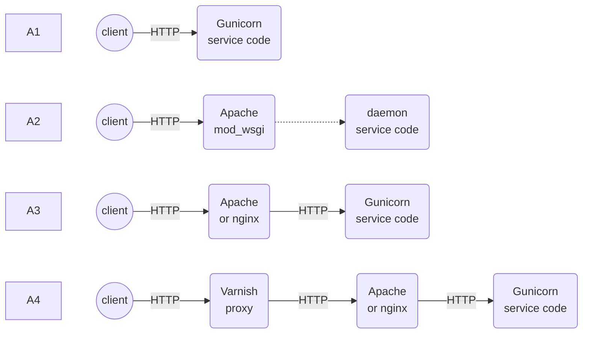

# HTTP servers
FPNP3e ch10


Objectives
---
- Learn off-the-shelf solutions for the major server patterns
- Respond to HTTP requests by
  - returning documents or web API


PSL builtin HTTP server
---
- A simple standalone HTTP server
- serve files at specified directory
  - used as a file server

```bash
python3 -m http.server -h
```

WSGI ( Web Server Gateway Interface)
---
- Early Python services were written as [CGI (Common Gateway Interface)](https://en.wikipedia.org/wiki/Common_Gateway_Interface) scripts invoked once per incoming request
  - Aided with the [PSL cgi module](https://docs.python.org/3/library/cgi.html)
- For better performance, PSL [http.server](https://docs.python.org/3/library/http.server.html) is recommended
  - can be customized by overloading  do_GET() and do_POST() by inheritting BaseHTTPRequestHandler
- To support both static and dynamic web content, [mod_python](https://modpython.org/) is suggested
  - Mod_python is an Apache module that embeds the Python interpreter within the server
- With the above methods, Python web services are difficult to migrate to new platforms
  - overcomed with Web Server Gateway Interface (WSGI)
- The WSGI standard [PEP 3333](https://peps.python.org/pep-3333/) 
  - a *middleware* between web servers and web applications or framework
  - supported by [many web servers and frameworks](https://wsgi.readthedocs.io/)


🖊️ Practice
---
- a WSGI application is a callable that takes two arguments
  - *environ*, a dictionary of environment variables
  - *a callable*, named start_response(), declares response headers
  - responses are generated with yield statements after start_response()
- play with [wsgi_env.py](./httpserver/wsgi_env.py)
  ```bash
  # open two terminals, one runs
  python3 wsgi_env.py
  # the other runs
  curl -v localhost:8000
  ```

Asynchronous Server-Frameworks 
---
- WSGI is synchronous in nature
  - to support asynchronous, try [uWSGI asynchronous/non-blocking modes](https://uwsgi-docs.readthedocs.io/)
- to write a HTTP service using a specific async engine like asyncio or [Tornado](https://www.tornadoweb.org/) or [Twisted](https://twisted.org/)
  - compatible HTTP server and the framework must be used


🔭 Explore
---
- [Twisted Web In 60 Seconds](https://docs.twisted.org/en/stable/web/howto/web-in-60/index.html)
- [Structure of a Tornado web application](https://www.tornadoweb.org/en/stable/guide/structure.html)


Forward and Reverse Proxies
---
- A [proxy server](https://en.wikipedia.org/wiki/Proxy_server) is a server application that acts as an intermediary between 
  - a client requesting a resource and the server providing that resource
- A *forward proxy* is an Internet-facing proxy used to retrieve data from a wide range of sources on the Internet
  - not work with TLS
- A *[reverse proxy](https://en.wikipedia.org/wiki/Reverse_proxy)* is usually an internal-facing proxy used as a front-end to
  - control and protect access to a server through HTTP on a private network
    - installed and operates as part of a web service
    - communicate with clients through HTTPS
  - perform tasks such as load-balancing, authentication, decryption and caching


🔭 Explore
---
- [Varnish-Cache - a caching HTTP reverse proxy](https://varnish-cache.org/)


Four Typical Architectures of Deploying HTTP Services
---
- Deploy Python code stand-alone or behind reverse HTTP proxies
- Choice is driven by the features of [CPython runtime](https://en.wikipedia.org/wiki/CPython)
  - the interpreter is large and slow
  -  its Global Interpret Lock prevents more than one thread at a time from executing Python bytecode
- Platform-as-a-Service (PaaS) with containerization becomes popular



- **A1**: Python WSGI HTTP Server
  - written in Python and call WSGI endpoint directly, such as
  - [Gunicorn 'Green Unicorn' — A Python WSGI HTTP Server](https://gunicorn.org/)
  - [CherryPy — A Minimalist Python Web Framework](https://docs.cherrypy.dev/)
  - [wsgiref — WSGI Utilities and Reference Implementation](https://docs.python.org/3/library/wsgiref.html)
- **A2**: Run Apache with mod_wsgi configured to run your Python code inside of a separate WSGIDaemonProcess. Typically,
  - Apache handles static content
  - mod_wsgi handles dynamic content with Python
- **A3**: Run a Python HTTP server like Gunicorn behind a web server that
  - serves static files directly 
  - acts a reverse proxy for the dynamic resources written in Python
  - load-balances requests 
- **A4**: Run a Python HTTP server behind Apache or nginx that sits behind a pure reverse proxy like Varnish
  - create a third tier that faces the real world
  - These reverse proxies can be geographically distributed  
    - so that cached resources are served from locations close to clients
    - such as [content distribution network (CDN)](https://en.wikipedia.org/wiki/Content_delivery_network)


WSGI Without a Framework
---
- It is rare to write low-level socket code to speak HTTP
- Many of the protocol details can be delegated 
  - web servers, such as Apache, nginx, etc.
    - invoke WSGI callables for HTTP requests
    - the WSGI callables can be coded directly or plugged into web frameworks
  - web frameworks
    - dispatch HTTP requests and handle abnormal requests default such as
      - 404 Not Found
      - 405 Method Not Allowed
      - 501 Not Implemented
- Two ways to code directly with WSGI
  - Write code following the WSGI specification
  - Use WSGI wrappers such as [WebOb](https://webob.org/) and [Werkzeug](https://werkzeug.palletsprojects.com/)
- Suitable for low-level tasks such as 
  - filtering, transforming, normalizing and dispatching requests
  - writing a custom reverse proxy, or a pure HTTP service
- Let web frameworks provide resources at specific hostnames and paths


🖊️ Practice
---
- Install WebOb and Werkzeug
  ```bash
  pip install WebOb Werkzeug
  ```
- [Raw WSGI Callable for Returning the Current Time](./httpserver/timeapp_raw.py)
- [WSGI Callable Written with WebOb for Returning the Current Time](./httpserver/timeapp_webob.py)
- [WSGI Callable Written with Werkzeug for Returning the Current Time](./httpserver/timeapp_werkz.py)
