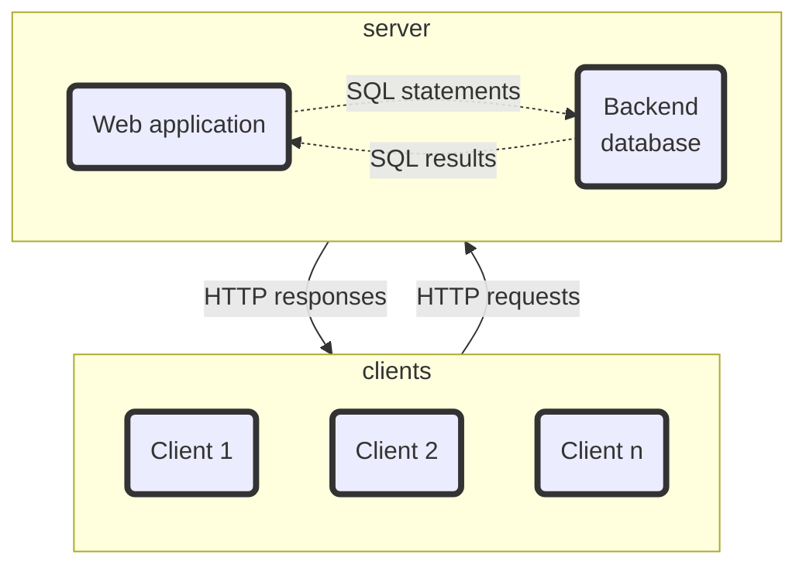

# A network-wide Rock-Paper-Scissors
_stage2_

## Description
Design and implement a online [Rock-Paper-Scissors](https://en.wikipedia.org/wiki/Rock_paper_scissors) game using *browser-server (BS) structure*. Each client is a player.



The server 
- starts first and listens for clients. 
- It can handle multiple clients and multiple game sessions concurrently. 

A client 
- connects to the server, 
- searches for players, 
- pairs a player to start a game session, 
- play the game until get a decided result, or quit the game, 
- lookup history records of all game sessions. 
- Each player can play multiple sessions in one connection.

In each execution, the server records the information below:
- date and time
- game session number and lasting time
- all players' information such as ip address, port number, player id, player game session and result
- paired players, game sessions and results (terminated or reach a decision)


## Questions
Justify your selections and answers for all the questions.

- Which WSGI web framework will you select, Flask or Django? 
- Which backend DBMS will you select, SQLite, MySQL, PostgreSQL, or MongoDB? How to design the database?
- How to design the hierarchy of the web application?
  - number of webpages and their functions
- How to carry game information over HTTP?
- What data structures will you use? 
- How to divide the game logic between the clients and the server?
- How to form and handle a game session?
- How to form and handle a HTTP session such as using cookies?
- What is the difference between a game session and a HTTP session?
  - handle multiple game sessions in one HTTP session
- What information needs to be recorded and how?
  - How many tables are needed in the database?
  - One table for players' information
  - One table for game sessions
  - and more?
- How to modularize and organize the game?
- How to secure the web application against XSS, CSRF and SQLi attacks?
- How to handle exceptions?
- How to test the game?


Your ideas and answers to these questions form the design, analysis, implementation, test, report and **presentation** of the game.

## Report
- Detail the game rules, design and implementation. 
- Explain program structure and flow.
- Demonstrate all game scenarios.
- Submit the report together with the source code.


## (10%) Extra credit
### (5%) Extending the game
The Rock-Paper-Scissors game can be generalized to include multiple players (more than two in one session) and multiple weapons (more than two):
- Multiple players: 
  - the number of players $N_p≥3$ can be configured
  - how to define the winning rules?
- Multiple weapons: 
  - the number of weapons $N_w ≥ 2$ can be configured
  - the weapon beating map can be configured
### (5%) Implement a GUI client app
Instead of using a standard web browser, implement the client application with HTTP client libraries such as urllib, Requests, etc. Supply the client application with a GUI interface through tkinter, PyQt, PyGUI, wxPython, etc.

# References
- *Web Frameworks in Python*
  - [Django](https://www.djangoproject.com/)
  - [the Pallets Projects](https://palletsprojects.com/)
- *Python DB-API*
  - [sqlite3 — DB-API 2.0 interface for SQLite databases](https://docs.python.org/3/library/sqlite3.html)
  - [MySQL Connector/Python Developer Guide](https://dev.mysql.com/doc/connector-python/en/)
- *GUI Frameworks in Python*
  - [PyGUI](https://dearpygui.readthedocs.io/)
  - [The Python GTK+ 3](https://python-gtk-3-tutorial.readthedocs.io/)
  - [PyQt](https://wiki.python.org/moin/PyQt)
  - [wxPython](https://wxpython.org/index.html)
  - Install [tkinter](https://tkdocs.com/)
    ```bash
    sudo apt install python3-tk
    ```
